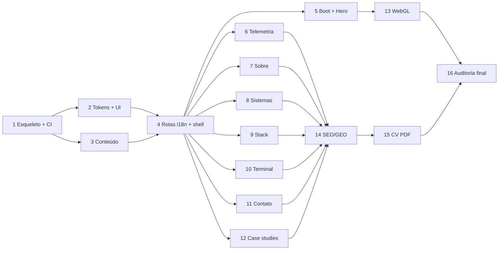

# Portfólio "Sala de Controle" — Implementation Plan

> **For agentic workers:** REQUIRED SUB-SKILL: Use superpowers:subagent-driven-development (recommended) or superpowers:executing-plans to implement this plan task-by-task. Steps use checkbox (`- [ ]`) syntax for tracking.

**Goal:** Publicar no GitHub Pages um portfólio bilíngue PT/EN de Neto Alves — arquiteto de sistemas vindo de 10+ anos de infraestrutura — com HTML estático completo em todas as rotas, três case studies, terminal interativo, constelação WebGL e CV em PDF gerado da mesma fonte de verdade.

**Architecture:** Next.js 16 App Router com `output: 'export'` — nenhum servidor em runtime. Todo conteúdo vive em dicionários tipados (`content/pt.ts`, `content/en.ts`) validados por um único `type Dictionary`, de modo que uma chave faltando em qualquer idioma quebra o `tsc` em vez de quebrar o site. Rotas geradas por `generateStaticParams` sobre `[locale]` e `[slug]`. As duas peças pesadas (cena three.js e terminal) são ilhas carregadas por `next/dynamic` fora do caminho crítico, e tudo que elas comunicam existe redundantemente em HTML.

**Tech Stack:** Next.js 16.2.12 · React 19.2 · TypeScript 5.9.3 · Tailwind CSS 4.3 · Motion 12 · three.js 0.185 + @react-three/fiber 9 · Vitest 4 · Playwright 1.62 · ESLint 10 · GitHub Actions → GitHub Pages

**Spec:** `docs/superpowers/specs/2026-08-02-portfolio-neto-alves-design.md` (commit `9582920`)

---

## Global Constraints

Estas regras valem para **todas** as tarefas. Os requisitos de cada tarefa incluem esta seção implicitamente.

**Versões (fixadas, verificadas no registry em 2026-08-02):**
- `next@16.2.12` · `react@19.2.8` · `react-dom@19.2.8`
- `typescript@5.9.3` — **não usar TypeScript 7.** O 7.0.2 é o port nativo em Go, recém-lançado, e o Next 16 não declara suporte. Um portfólio não é lugar de depurar um compilador reescrito.
- `tailwindcss@4.3.3` + `@tailwindcss/postcss@4.3.3` — Tailwind v4 é **CSS-first**: configuração em `@theme` dentro do CSS, sem `tailwind.config.js`.
- `motion@12.43.0` — import é `motion/react`, não `framer-motion`.
- `three@0.185.1` · `@react-three/fiber@9.7.0` · `@react-three/drei@10.7.7` · `@types/three@0.185.3`
- `vitest@4.1.10` · `@vitejs/plugin-react@6.0.5` · `@testing-library/react@16.3.2` · `jsdom@30.0.1` · `vite-tsconfig-paths`
- `@playwright/test@1.62.1` · `eslint@10.8.0` · `eslint-plugin-jsx-a11y@6.10.2` · `geist@1.7.2`

**Plataforma:** Windows 11, PowerShell. Comandos do plano estão em forma POSIX (Bash tool) — funcionam no Git Bash. Node ≥ 20.

**Sem runtime de servidor.** `output: 'export'`. Proibido: Route Handlers, Server Actions, `redirect()`, `cookies()`, `headers()`, ISR, middleware. Se uma tarefa parecer precisar de qualquer um destes, ela está errada.

**Paleta — valores exatos, copiados do spec §3.1.** Nunca introduzir cor fora desta lista:

| Token | Hex |
|---|---|
| `--color-bg` | `#08090C` |
| `--color-surface` | `#101317` |
| `--color-surface-2` | `#161A20` |
| `--color-border` | `#1F232B` |
| `--color-text` | `#F5F3EF` |
| `--color-muted` | `#878C96` |
| `--color-faint` | `#4A505A` |
| `--color-ok` | `#4ADE80` |
| `--color-warn` | `#FFB020` |
| `--color-off` | `#6B7280` |
| `--color-data` | `#38BDF8` |

**Cor é informação, nunca decoração.** `--color-text` (osso) é o acento da marca. As quatro cores semânticas só aparecem carregando significado. Status **nunca** é comunicado só por cor: sempre ponto + rótulo escrito.

**Números canônicos** (spec §4) — usar exatamente estes, em qualquer superfície:

| Métrica | Valor |
|---|---|
| Anos em infraestrutura | `10+` |
| Linhas de código (exibido) | `250.000+` |
| Linhas de código (medido, para tooltip) | `265.562` |
| Sistemas | `9` |
| Em produção | `5` |
| Commits | `1.675` |
| Tabelas modeladas | `214` |
| Endpoints HTTP | `459` |
| Migrations SQL | `130` |
| Casos de teste | `1.270` |
| Data da medição | `2026-08-02` |

**Regras de conteúdo (não negociáveis):**
- CS50 sempre rotulado **certificações HarvardX**, jamais graduação.
- Graduação exibida como `Análise de Dados — Estácio`, **sem rótulo de status** em nenhuma superfície (site, CV, JSON-LD).
- Todo número exibido carrega procedência (como foi medido + data).
- Proibidos os clichês "apaixonado por tecnologia" e "transformo café em código".
- Cisco/MikroTik/Furukawa vêm de experiência declarada, não de repositório — a seção Stack deve tornar essa distinção visível.

**Acessibilidade (todas as tarefas):** `prefers-reduced-motion: reduce` desliga toda animação; navegação completa por teclado com foco visível; contraste AA mínimo; um `<h1>` por página; decoração sempre `aria-hidden`.

**Commits:** um por tarefa no mínimo, mensagem em português no imperativo, prefixo convencional (`feat:`, `test:`, `chore:`, `docs:`). Rodapé `Co-Authored-By: Claude Opus 5 <noreply@anthropic.com>`.

---

## Estrutura de arquivos

Mapeada antes das tarefas. Cada arquivo tem uma responsabilidade.

```
portfolio/
├─ .github/workflows/deploy.yml     CI: lint → typecheck → test → build → test:html → deploy
├─ next.config.ts                   output export, basePath por env
├─ postcss.config.mjs               @tailwindcss/postcss
├─ vitest.config.ts                 jsdom + alias @/
├─ playwright.config.ts             E2E contra o out/ servido
├─ eslint.config.mjs                flat config + jsx-a11y
├─ app/
│  ├─ layout.tsx                    pass-through (o <html> vive em [locale])
│  └─ [locale]/
│     ├─ layout.tsx                 <html lang>, fontes, metadata base, JSON-LD Person
│     ├─ page.tsx                   home — compõe as 7 seções
│     ├─ cv/page.tsx                alvo do PDF, noindex, @media print
│     ├─ og/[slug]/page.tsx         alvo do screenshot OG 1200×630, noindex
│     └─ sistemas/[slug]/page.tsx   case study
├─ components/
│  ├─ layout/                       Header, Footer, LocaleSwitch, SkipLink
│  ├─ sections/                     Boot, Hero, Telemetry, About, Systems, Stack, Terminal, Contact
│  ├─ three/                        Constellation (ilha), ConstellationFallback (SVG)
│  ├─ terminal/                     TerminalIsland, useTerminal, commands.ts
│  └─ ui/                           Section, StatusBadge, Metric, Counter, Reveal, PhotoFrame
├─ content/
│  ├─ types.ts                      locales, Locale, Dictionary — o contrato
│  ├─ systems.ts                    dados medidos, neutros de idioma
│  ├─ pt.ts  en.ts                  dicionários
│  └─ index.ts                      getDictionary(locale)
├─ lib/
│  ├─ seo.ts                        buildMetadata(locale, page)
│  ├─ jsonld.ts                     Person, CreativeWork
│  └─ motion.ts                     usePrefersReducedMotion
├─ scripts/
│  ├─ write-root-redirect.mts       gera out/index.html → /pt/
│  ├─ generate-og.mts               Playwright screenshot das rotas /og
│  ├─ generate-cv-pdf.mts           Playwright PDF das rotas /cv
│  └─ generate-seo-files.mts        sitemap.xml, robots.txt, llms.txt
├─ tests/
│  ├─ setup.ts
│  ├─ unit/                         componentes e libs
│  ├─ content.test.ts               paridade de chaves PT/EN
│  ├─ static-html.test.ts           o portão de GEO — roda sobre out/
│  └─ e2e/                          Playwright
└─ public/
   ├─ foto/                         a receber do dono
   ├─ cv/  og/                      gerados no build
   └─ llms.txt                      gerado no build
```

---

## Grafo de dependências



**Tarefas 5–12 são independentes entre si** e podem ser executadas em paralelo por agentes distintos após a 4.

---

### Task 1: Esqueleto — projeto, ferramentas e pipeline de deploy

Entrega uma página no ar no GitHub Pages. Nada de design ainda; o objetivo é fechar o circuito de deploy antes de escrever qualquer feature.

**Files:**
- Create: `package.json`, `next.config.ts`, `tsconfig.json`, `postcss.config.mjs`, `eslint.config.mjs`, `vitest.config.ts`, `.gitignore`, `app/layout.tsx`, `app/page.tsx`, `app/globals.css`, `.github/workflows/deploy.yml`, `tests/setup.ts`, `tests/unit/smoke.test.tsx`

**Interfaces:**
- Consumes: nada
- Produces: scripts npm `dev`, `build`, `lint`, `typecheck`, `test`, `test:html`; alias `@/*` → raiz do projeto

- [ ] **Step 1: Criar o projeto e instalar as dependências fixadas**

```bash
cd /g/documentos/portfolio
npm init -y
npm pkg set name="portfolio" private=true type="module"
npm i next@16.2.12 react@19.2.8 react-dom@19.2.8 motion@12.43.0 geist@1.7.2
npm i -D typescript@5.9.3 @types/node @types/react @types/react-dom \
  tailwindcss@4.3.3 @tailwindcss/postcss@4.3.3 \
  vitest@4.1.10 @vitejs/plugin-react@6.0.5 vite-tsconfig-paths \
  @testing-library/react@16.3.2 @testing-library/user-event jsdom@30.0.1 \
  eslint@10.8.0 eslint-plugin-jsx-a11y@6.10.2 @eslint/js typescript-eslint \
  @playwright/test@1.62.1
```

- [ ] **Step 2: Escrever os arquivos de configuração**

`next.config.ts` — o `basePath` por variável é o que permite migrar para domínio próprio depois sem refatorar (spec §5.5). `trailingSlash` é obrigatório no GitHub Pages: sem ele, `/pt` não resolve para `/pt/index.html`.

```ts
import type { NextConfig } from 'next'

const basePath = process.env.NEXT_PUBLIC_BASE_PATH ?? '/portfolio'

export default {
  output: 'export',
  basePath,
  assetPrefix: basePath,
  trailingSlash: true,
  images: { unoptimized: true },
  reactStrictMode: true,
} satisfies NextConfig
```

`tsconfig.json`:

```json
{
  "compilerOptions": {
    "target": "ES2022",
    "lib": ["dom", "dom.iterable", "ES2022"],
    "jsx": "preserve",
    "module": "esnext",
    "moduleResolution": "bundler",
    "strict": true,
    "noUncheckedIndexedAccess": true,
    "noEmit": true,
    "esModuleInterop": true,
    "resolveJsonModule": true,
    "isolatedModules": true,
    "incremental": true,
    "skipLibCheck": true,
    "allowJs": true,
    "plugins": [{ "name": "next" }],
    "paths": { "@/*": ["./*"] }
  },
  "include": ["next-env.d.ts", "**/*.ts", "**/*.tsx", ".next/types/**/*.ts"],
  "exclude": ["node_modules", "out", ".next"]
}
```

`postcss.config.mjs`:

```js
export default { plugins: { '@tailwindcss/postcss': {} } }
```

`vitest.config.ts`:

```ts
import { defineConfig } from 'vitest/config'
import react from '@vitejs/plugin-react'
import tsconfigPaths from 'vite-tsconfig-paths'

export default defineConfig({
  plugins: [react(), tsconfigPaths()],
  test: {
    environment: 'jsdom',
    setupFiles: ['./tests/setup.ts'],
    globals: true,
    include: ['tests/**/*.test.{ts,tsx}'],
    exclude: ['tests/e2e/**', 'tests/static-html.test.ts'],
  },
})
```

`tests/setup.ts` — `matchMedia` não existe no jsdom e vários componentes dependem dele para `prefers-reduced-motion`:

```ts
import '@testing-library/jest-dom/vitest'
import { vi } from 'vitest'

Object.defineProperty(window, 'matchMedia', {
  writable: true,
  value: vi.fn().mockImplementation((query: string) => ({
    matches: false,
    media: query,
    onchange: null,
    addEventListener: vi.fn(),
    removeEventListener: vi.fn(),
    dispatchEvent: vi.fn(),
  })),
})
```

```bash
npm i -D @testing-library/jest-dom
```

`.gitignore`:

```
node_modules/
.next/
out/
next-env.d.ts
*.tsbuildinfo
.env*.local
test-results/
playwright-report/
```

- [ ] **Step 3: Registrar os scripts npm**

```bash
npm pkg set scripts.dev="next dev"
npm pkg set scripts.build="next build"
npm pkg set scripts.lint="eslint ."
npm pkg set scripts.typecheck="tsc --noEmit"
npm pkg set scripts.test="vitest run"
npm pkg set scripts.test:html="vitest run --config vitest.html.config.ts"
```

- [ ] **Step 4: Escrever o teste de fumaça (falhando)**

`tests/unit/smoke.test.tsx`:

```tsx
import { render, screen } from '@testing-library/react'
import { describe, expect, it } from 'vitest'
import Page from '@/app/page'

describe('página raiz', () => {
  it('renderiza a marca', () => {
    render(<Page />)
    expect(screen.getByRole('heading', { name: /neto alves/i })).toBeInTheDocument()
  })
})
```

- [ ] **Step 5: Rodar e confirmar que falha**

Run: `npm test`
Expected: FAIL — `Cannot find module '@/app/page'`

- [ ] **Step 6: Implementar o mínimo**

`app/globals.css`:

```css
@import "tailwindcss";

@theme {
  --color-bg: #08090C;
  --color-text: #F5F3EF;
}

html { color-scheme: dark; }
body { background: var(--color-bg); color: var(--color-text); }
```

`app/layout.tsx`:

```tsx
import './globals.css'

export default function RootLayout({ children }: { children: React.ReactNode }) {
  return (
    <html lang="pt-BR">
      <body>{children}</body>
    </html>
  )
}
```

`app/page.tsx`:

```tsx
export default function Page() {
  return <h1>Neto Alves</h1>
}
```

- [ ] **Step 7: Rodar e confirmar que passa**

Run: `npm test`
Expected: PASS

- [ ] **Step 8: Confirmar que o build estático sai**

Run: `npm run build && ls out/`
Expected: existe `out/index.html`, e `grep -q "Neto Alves" out/index.html` retorna 0

- [ ] **Step 9: Escrever o workflow de deploy**

`.github/workflows/deploy.yml`. O `.nojekyll` é obrigatório: sem ele o GitHub Pages ignora tudo que começa com `_`, e o Next serve os assets em `_next/`.

```yaml
name: deploy
on:
  push:
    branches: [main]
  workflow_dispatch:

permissions:
  contents: read
  pages: write
  id-token: write

concurrency:
  group: pages
  cancel-in-progress: true

jobs:
  build:
    runs-on: ubuntu-latest
    steps:
      - uses: actions/checkout@v4
      - uses: actions/setup-node@v4
        with:
          node-version: 22
          cache: npm
      - run: npm ci
      - run: npm run lint
      - run: npm run typecheck
      - run: npm test
      - run: npm run build
        env:
          NEXT_PUBLIC_BASE_PATH: /portfolio
          NEXT_PUBLIC_WEB3FORMS_KEY: ${{ secrets.WEB3FORMS_KEY }}
      - run: touch out/.nojekyll
      - uses: actions/configure-pages@v5
      - uses: actions/upload-pages-artifact@v3
        with:
          path: out

  deploy:
    needs: build
    runs-on: ubuntu-latest
    environment:
      name: github-pages
      url: ${{ steps.deployment.outputs.page_url }}
    steps:
      - id: deployment
        uses: actions/deploy-pages@v4
```

- [ ] **Step 10: Escrever o ESLint flat config**

`eslint.config.mjs`:

```js
import js from '@eslint/js'
import tseslint from 'typescript-eslint'
import jsxA11y from 'eslint-plugin-jsx-a11y'

export default tseslint.config(
  { ignores: ['.next/**', 'out/**', 'node_modules/**'] },
  js.configs.recommended,
  ...tseslint.configs.recommended,
  {
    files: ['**/*.{ts,tsx}'],
    plugins: { 'jsx-a11y': jsxA11y },
    rules: { ...jsxA11y.configs.recommended.rules },
  },
)
```

Run: `npm run lint && npm run typecheck`
Expected: ambos passam

- [ ] **Step 11: Commit**

```bash
git add -A
git commit -m "feat: esqueleto Next 16 SSG com CI para GitHub Pages

Fecha o circuito de deploy antes de qualquer feature. basePath por
variavel de ambiente para permitir dominio proprio depois sem refatorar.
trailingSlash ligado porque o Pages nao resolve /pt sem ele, e .nojekyll
porque o Pages ignora _next/ sem esse arquivo.

TypeScript fixado em 5.9.3: o 7.x e o port nativo em Go e o Next 16 nao
declara suporte.

Co-Authored-By: Claude Opus 5 <noreply@anthropic.com>"
```

---

### Task 2: Design system — tokens, fontes e primitivos de UI

**Files:**
- Modify: `app/globals.css`
- Create: `lib/motion.ts`, `components/ui/Section.tsx`, `components/ui/StatusBadge.tsx`, `components/ui/Metric.tsx`, `components/ui/Counter.tsx`, `components/ui/Reveal.tsx`
- Test: `tests/unit/status-badge.test.tsx`, `tests/unit/counter.test.tsx`, `tests/unit/metric.test.tsx`

**Interfaces:**
- Consumes: nada da Task 1 além do build
- Produces:
  - `usePrefersReducedMotion(): boolean`
  - `<Section id={string} label={string} children>` — `<section>` com `aria-labelledby`
  - `<StatusBadge status={'ok'|'warn'|'off'} label={string} />`
  - `<Metric value={string} label={string} provenance={string} />`
  - `<Counter to={number} suffix?={string} durationMs?={number} />`
  - `<Reveal delayMs?={number} children>`

- [ ] **Step 1: Escrever os testes (falhando)**

`tests/unit/status-badge.test.tsx` — o teste trava a regra do spec de que status nunca é só cor:

```tsx
import { render, screen } from '@testing-library/react'
import { describe, expect, it } from 'vitest'
import { StatusBadge } from '@/components/ui/StatusBadge'

describe('StatusBadge', () => {
  it('expõe o rótulo como texto, não apenas cor', () => {
    render(<StatusBadge status="ok" label="OPERACIONAL" />)
    expect(screen.getByText('OPERACIONAL')).toBeInTheDocument()
  })

  it('marca o ponto colorido como decorativo', () => {
    const { container } = render(<StatusBadge status="warn" label="PROPRIETÁRIO" />)
    const dot = container.querySelector('[data-dot]')
    expect(dot).toHaveAttribute('aria-hidden', 'true')
  })
})
```

`tests/unit/counter.test.tsx` — trava a regra de reduced-motion:

```tsx
import { render, screen } from '@testing-library/react'
import { describe, expect, it, vi } from 'vitest'
import { Counter } from '@/components/ui/Counter'

function setReducedMotion(reduced: boolean) {
  vi.mocked(window.matchMedia).mockImplementation((query: string) => ({
    matches: reduced && query.includes('reduce'),
    media: query,
    onchange: null,
    addEventListener: vi.fn(),
    removeEventListener: vi.fn(),
    dispatchEvent: vi.fn(),
  }) as MediaQueryList)
}

describe('Counter', () => {
  it('com reduced-motion, mostra o valor final imediatamente', () => {
    setReducedMotion(true)
    render(<Counter to={1675} />)
    expect(screen.getByText('1.675')).toBeInTheDocument()
  })

  it('formata em pt-BR e aplica o sufixo', () => {
    setReducedMotion(true)
    render(<Counter to={250000} suffix="+" />)
    expect(screen.getByText('250.000+')).toBeInTheDocument()
  })
})
```

`tests/unit/metric.test.tsx` — trava a regra de procedência do spec §4.3:

```tsx
import { render, screen } from '@testing-library/react'
import { describe, expect, it } from 'vitest'
import { Metric } from '@/components/ui/Metric'

describe('Metric', () => {
  it('sempre expõe a procedência do número', () => {
    render(
      <Metric
        value="250.000+"
        label="linhas de código"
        provenance="Soma de 9 repositórios, excluindo dependências. Medido em 2026-08-02."
      />,
    )
    expect(screen.getByText(/Medido em 2026-08-02/)).toBeInTheDocument()
  })
})
```

- [ ] **Step 2: Rodar e confirmar que falham**

Run: `npm test`
Expected: FAIL — os três módulos não existem

- [ ] **Step 3: Escrever os tokens completos no CSS**

`app/globals.css` — substitui o bloco `@theme` da Task 1 pelos 11 tokens do spec §3.1, mais tipografia e o grid técnico:

```css
@import "tailwindcss";

@theme {
  --color-bg: #08090C;
  --color-surface: #101317;
  --color-surface-2: #161A20;
  --color-border: #1F232B;
  --color-text: #F5F3EF;
  --color-muted: #878C96;
  --color-faint: #4A505A;
  --color-ok: #4ADE80;
  --color-warn: #FFB020;
  --color-off: #6B7280;
  --color-data: #38BDF8;

  --font-sans: var(--font-geist-sans), system-ui, sans-serif;
  --font-mono: var(--font-geist-mono), ui-monospace, monospace;
}

html { color-scheme: dark; }

body {
  background: var(--color-bg);
  color: var(--color-text);
  font-family: var(--font-sans);
  -webkit-font-smoothing: antialiased;
}

/* Grid técnico — puramente decorativo, sempre aria-hidden no markup */
.grid-tecnico {
  background-image:
    linear-gradient(to right, var(--color-faint) 1px, transparent 1px),
    linear-gradient(to bottom, var(--color-faint) 1px, transparent 1px);
  background-size: 64px 64px;
  opacity: 0.06;
}

:focus-visible {
  outline: 2px solid var(--color-text);
  outline-offset: 3px;
}

@media (prefers-reduced-motion: reduce) {
  *, *::before, *::after {
    animation-duration: 0.01ms !important;
    animation-iteration-count: 1 !important;
    transition-duration: 0.01ms !important;
    scroll-behavior: auto !important;
  }
}
```

- [ ] **Step 4: Implementar o hook de movimento**

`lib/motion.ts`:

```ts
'use client'
import { useEffect, useState } from 'react'

const QUERY = '(prefers-reduced-motion: reduce)'

export function usePrefersReducedMotion(): boolean {
  const [reduced, setReduced] = useState(false)

  useEffect(() => {
    const mql = window.matchMedia(QUERY)
    setReduced(mql.matches)
    const onChange = (e: MediaQueryListEvent) => setReduced(e.matches)
    mql.addEventListener('change', onChange)
    return () => mql.removeEventListener('change', onChange)
  }, [])

  return reduced
}
```

- [ ] **Step 5: Implementar os primitivos**

`components/ui/StatusBadge.tsx`:

```tsx
const COLOR = { ok: 'bg-ok', warn: 'bg-warn', off: 'bg-off' } as const

export function StatusBadge({
  status,
  label,
}: {
  status: keyof typeof COLOR
  label: string
}) {
  return (
    <span className="inline-flex items-center gap-2 border border-border bg-surface px-2 py-1 font-mono text-[11px] uppercase tracking-widest text-muted">
      <span data-dot aria-hidden="true" className={`size-1.5 rounded-full ${COLOR[status]}`} />
      {label}
    </span>
  )
}
```

`components/ui/Counter.tsx`:

```tsx
'use client'
import { useEffect, useRef, useState } from 'react'
import { usePrefersReducedMotion } from '@/lib/motion'

const fmt = new Intl.NumberFormat('pt-BR')

export function Counter({
  to,
  suffix = '',
  durationMs = 1200,
}: {
  to: number
  suffix?: string
  durationMs?: number
}) {
  const reduced = usePrefersReducedMotion()
  const [value, setValue] = useState(reduced ? to : 0)
  const ref = useRef<HTMLSpanElement>(null)

  useEffect(() => {
    if (reduced) {
      setValue(to)
      return
    }
    const el = ref.current
    if (!el) return

    const io = new IntersectionObserver(
      ([entry]) => {
        if (!entry?.isIntersecting) return
        io.disconnect()
        const start = performance.now()
        const tick = (now: number) => {
          const t = Math.min(1, (now - start) / durationMs)
          // easeOutCubic — desacelera no fim, que é onde o olho pousa
          setValue(Math.round(to * (1 - Math.pow(1 - t, 3))))
          if (t < 1) requestAnimationFrame(tick)
        }
        requestAnimationFrame(tick)
      },
      { threshold: 0.4 },
    )
    io.observe(el)
    return () => io.disconnect()
  }, [to, durationMs, reduced])

  return (
    <span ref={ref}>
      {fmt.format(value)}
      {suffix}
    </span>
  )
}
```

`components/ui/Metric.tsx` — a procedência é `title` **e** texto para leitor de tela, porque tooltip por `title` não é acessível sozinho:

```tsx
import { Counter } from './Counter'

export function Metric({
  value,
  label,
  provenance,
  numeric,
  suffix,
}: {
  value: string
  label: string
  provenance: string
  numeric?: number
  suffix?: string
}) {
  return (
    <div className="border border-border bg-surface p-5">
      <div className="font-sans text-4xl font-bold tabular-nums" title={provenance}>
        {numeric !== undefined ? <Counter to={numeric} suffix={suffix} /> : value}
      </div>
      <div className="mt-2 font-mono text-[11px] uppercase tracking-widest text-muted">
        {label}
      </div>
      <p className="mt-3 font-mono text-[11px] leading-relaxed text-faint">{provenance}</p>
    </div>
  )
}
```

`components/ui/Section.tsx`:

```tsx
export function Section({
  id,
  label,
  index,
  children,
}: {
  id: string
  label: string
  index?: string
  children: React.ReactNode
}) {
  return (
    <section id={id} aria-labelledby={`${id}-title`} className="border-t border-border py-24">
      <div className="mx-auto w-full max-w-6xl px-6">
        <h2
          id={`${id}-title`}
          className="mb-12 font-mono text-[11px] uppercase tracking-[0.2em] text-muted"
        >
          {index ? <span className="text-faint">{index} </span> : null}
          {label}
        </h2>
        {children}
      </div>
    </section>
  )
}
```

`components/ui/Reveal.tsx`:

```tsx
'use client'
import { motion } from 'motion/react'
import { usePrefersReducedMotion } from '@/lib/motion'

export function Reveal({
  children,
  delayMs = 0,
}: {
  children: React.ReactNode
  delayMs?: number
}) {
  const reduced = usePrefersReducedMotion()
  if (reduced) return <>{children}</>

  return (
    <motion.div
      initial={{ opacity: 0, y: 16 }}
      whileInView={{ opacity: 1, y: 0 }}
      viewport={{ once: true, amount: 0.3 }}
      transition={{ duration: 0.5, delay: delayMs / 1000, ease: [0.22, 1, 0.36, 1] }}
    >
      {children}
    </motion.div>
  )
}
```

- [ ] **Step 6: Ligar as fontes Geist**

`app/layout.tsx` — `geist` usa `next/font` por baixo, que faz self-hosting no build. Nenhuma requisição a terceiro no caminho crítico:

```tsx
import './globals.css'
import { GeistSans } from 'geist/font/sans'
import { GeistMono } from 'geist/font/mono'

export default function RootLayout({ children }: { children: React.ReactNode }) {
  return (
    <html lang="pt-BR" className={`${GeistSans.variable} ${GeistMono.variable}`}>
      <body>{children}</body>
    </html>
  )
}
```

- [ ] **Step 7: Rodar e confirmar que passam**

Run: `npm test && npm run typecheck`
Expected: PASS nos 5 testes

- [ ] **Step 8: Commit**

```bash
git add -A
git commit -m "feat: design system com tokens, fontes Geist e primitivos

Paleta monocromatica do spec 3.1: o acento da marca e o osso, e as
quatro cores semanticas so aparecem carregando significado.

StatusBadge tem teste travando a regra de que status nunca e comunicado
so por cor -- sempre ponto mais rotulo escrito. Metric tem teste
travando a regra de procedencia: nenhum numero aparece sem dizer como
foi medido. Counter respeita prefers-reduced-motion indo direto ao
valor final.

Co-Authored-By: Claude Opus 5 <noreply@anthropic.com>"
```

---

### Task 3: Camada de conteúdo — contrato tipado e dicionários PT/EN

O coração do i18n. O `type Dictionary` é o contrato: chave faltando em qualquer idioma quebra o `tsc`, não o site em produção.

**Files:**
- Create: `content/types.ts`, `content/systems.ts`, `content/pt.ts`, `content/en.ts`, `content/index.ts`
- Test: `tests/content.test.ts`

**Interfaces:**
- Consumes: nada
- Produces:
  - `locales: readonly ['pt','en']`, `type Locale = 'pt' | 'en'`
  - `type Dictionary` — a forma completa do conteúdo
  - `getDictionary(locale: Locale): Dictionary`
  - `systems: readonly System[]` com `System = { slug, name, status, statusLabelKey, metrics: Metric[], stack: string[], repoUrl?, liveUrl? }`
  - `SYSTEM_SLUGS: readonly ['oscapstack','saturno-labs','moveis-pro']`

- [ ] **Step 1: Escrever o teste de paridade (falhando)**

`tests/content.test.ts` — o `tsc` já garante que EN tem todas as chaves de `Dictionary`, mas não garante que não sobram chaves nem que nenhum valor ficou vazio. Este teste fecha esses dois buracos:

```ts
import { describe, expect, it } from 'vitest'
import { pt } from '@/content/pt'
import { en } from '@/content/en'
import { systems, SYSTEM_SLUGS } from '@/content/systems'

function flatten(obj: unknown, prefix = ''): string[] {
  if (obj === null || typeof obj !== 'object') return [prefix]
  if (Array.isArray(obj)) return obj.flatMap((v, i) => flatten(v, `${prefix}[${i}]`))
  return Object.entries(obj).flatMap(([k, v]) => flatten(v, prefix ? `${prefix}.${k}` : k))
}

function leaves(obj: unknown, prefix = ''): [string, unknown][] {
  if (obj === null || typeof obj !== 'object') return [[prefix, obj]]
  if (Array.isArray(obj)) return obj.flatMap((v, i) => leaves(v, `${prefix}[${i}]`))
  return Object.entries(obj).flatMap(([k, v]) => leaves(v, prefix ? `${prefix}.${k}` : k))
}

describe('dicionários', () => {
  it('PT e EN têm exatamente as mesmas chaves', () => {
    expect(flatten(en).sort()).toEqual(flatten(pt).sort())
  })

  it('nenhum valor de texto está vazio', () => {
    for (const dict of [pt, en]) {
      for (const [path, value] of leaves(dict)) {
        expect(typeof value === 'string' ? value.trim().length : 1, `vazio em ${path}`).toBeGreaterThan(0)
      }
    }
  })

  it('não contém os clichês proibidos pelo spec', () => {
    const proibidos = [/apaixonado por tecnologia/i, /caf[ée] em c[óo]digo/i, /passionate about tech/i]
    for (const dict of [pt, en]) {
      const texto = leaves(dict).map(([, v]) => String(v)).join(' ')
      for (const p of proibidos) expect(texto).not.toMatch(p)
    }
  })

  it('rotula os CS50 como certificação, nunca como graduação', () => {
    for (const dict of [pt, en]) {
      const cert = dict.about.education.certifications
      expect(cert.items.join(' ')).toMatch(/CS50/)
      expect(cert.label.toLowerCase()).not.toMatch(/gradua|degree|bachelor/)
      expect(dict.about.education.degree.items.join(' ')).not.toMatch(/CS50/)
    }
  })

  it('não afirma status da graduação em nenhum idioma', () => {
    const status = [/conclu[íi]d/i, /em andamento/i, /cursando/i, /completed/i, /in progress/i]
    for (const dict of [pt, en]) {
      const texto = dict.about.education.degree.items.join(' ')
      for (const s of status) expect(texto).not.toMatch(s)
    }
  })

  it('cobre exatamente os 3 sistemas do spec', () => {
    expect(systems.map((s) => s.slug)).toEqual([...SYSTEM_SLUGS])
    for (const dict of [pt, en]) {
      expect(Object.keys(dict.systems.detail).sort()).toEqual([...SYSTEM_SLUGS].sort())
    }
  })
})
```

- [ ] **Step 2: Rodar e confirmar que falha**

Run: `npm test -- tests/content.test.ts`
Expected: FAIL — `Cannot find module '@/content/pt'`

- [ ] **Step 3: Escrever o contrato**

`content/types.ts`:

```ts
export const locales = ['pt', 'en'] as const
export type Locale = (typeof locales)[number]

export const SYSTEM_SLUGS = ['oscapstack', 'saturno-labs', 'moveis-pro'] as const
export type SystemSlug = (typeof SYSTEM_SLUGS)[number]

export type MetricValue = {
  /** Chave de tradução do rótulo. */
  key: string
  /** Valor já formatado, ex.: "250.000+". */
  value: string
  /** Valor numérico, quando o contador deve animar. */
  numeric?: number
  suffix?: string
}

export type StackLayer = {
  label: string
  /** `repo` = comprovado em código auditado. `experience` = experiência profissional declarada. */
  source: 'repo' | 'experience'
  items: { name: string; level: 'dominio' | 'producao' | 'contato' }[]
}

export type CaseStudy = {
  name: string
  tagline: string
  problem: string
  architecture: string
  decisions: { title: string; body: string }[]
  stack: string[]
  retro: string
}

export type Dictionary = {
  meta: { title: string; description: string; ogAlt: string }
  nav: { about: string; systems: string; stack: string; terminal: string; contact: string; cv: string }
  a11y: { skipToContent: string; localeSwitch: string; openMenu: string }
  boot: { lines: string[] }
  hero: {
    name: string
    role: string
    tagline: string
    availability: string
    scrollHint: string
  }
  telemetry: {
    label: string
    metrics: MetricValue[]
    secondaryLabel: string
    secondary: MetricValue[]
  }
  about: {
    label: string
    lead: string
    body: string[]
    photoAlt: string
    photoPending: string
    experience: { label: string; years: string; body: string; vendors: string[] }
    education: {
      label: string
      technical: { label: string; items: string[] }
      degree: { label: string; items: string[] }
      certifications: { label: string; institution: string; items: string[] }
    }
  }
  systems: {
    label: string
    statusLabels: Record<'ok' | 'warn' | 'off', string>
    readCase: string
    proprietaryNote: string
    detail: Record<SystemSlug, CaseStudy>
    caseLabels: {
      problem: string
      architecture: string
      decisions: string
      stack: string
      retro: string
      backToHome: string
    }
  }
  stack: {
    label: string
    lead: string
    levels: Record<'dominio' | 'producao' | 'contato', string>
    sourceNote: Record<'repo' | 'experience', string>
    layers: StackLayer[]
  }
  terminal: {
    label: string
    lead: string
    prompt: string
    welcome: string[]
    hint: string
    unknown: string
    ariaLabel: string
    ariaOutput: string
    responses: Record<string, string[]>
  }
  contact: {
    label: string
    lead: string
    form: {
      name: string
      email: string
      message: string
      submit: string
      sending: string
      success: string
      error: string
      honeypotLabel: string
    }
    disabledNote: string
    whatsapp: string
    whatsappMessage: string
    email: string
    github: string
    linkedin: string
    cvDownload: string
  }
  footer: { rights: string; builtWith: string; sourceCode: string }
}
```

- [ ] **Step 4: Escrever os dados medidos (neutros de idioma)**

`content/systems.ts` — números do spec §4.2 e §6.5. Nenhum texto traduzível aqui:

```ts
import type { SystemSlug } from './types'
import { SYSTEM_SLUGS } from './types'

export { SYSTEM_SLUGS }

export type System = {
  slug: SystemSlug
  name: string
  status: 'ok' | 'warn' | 'off'
  proprietary: boolean
  /** Rótulos curtos de telemetria; a unidade é traduzida via dicionário. */
  metrics: { key: string; value: string }[]
  stack: string[]
  repoUrl?: string
  liveUrl?: string
}

export const systems: readonly System[] = [
  {
    slug: 'oscapstack',
    name: 'OSCapstack CRM',
    status: 'ok',
    proprietary: true,
    metrics: [
      { key: 'lines', value: '78.900' },
      { key: 'tables', value: '56' },
      { key: 'policies', value: '146' },
      { key: 'endpoints', value: '219' },
    ],
    stack: ['TypeScript', 'Fastify 5', 'Supabase', 'PostgreSQL', 'React', 'Astro', 'Playwright', 'pgTAP', 'Docker'],
  },
  {
    slug: 'saturno-labs',
    name: 'Saturno Labs',
    status: 'warn',
    proprietary: true,
    metrics: [
      { key: 'lines', value: '37.672' },
      { key: 'packages', value: '14' },
      { key: 'tables', value: '60' },
      { key: 'tests', value: '1.102' },
    ],
    stack: ['TypeScript', 'Fastify 5', 'Zod', 'PostgreSQL', 'pgvector', 'Drizzle', 'BullMQ', 'Redis', 'React', 'three.js'],
  },
  {
    slug: 'moveis-pro',
    name: 'Moveis.pro',
    status: 'ok',
    proprietary: false,
    metrics: [
      { key: 'lines', value: '56.500' },
      { key: 'models', value: '40' },
      { key: 'commits', value: '231' },
      { key: 'apps', value: '3' },
    ],
    stack: ['TypeScript', 'Next.js', 'Fastify', 'Prisma', 'PostgreSQL', 'PWA', 'Docker', 'Nginx'],
    repoUrl: 'https://github.com/netoguild-rgb/Moveis.pro',
  },
] as const
```

- [ ] **Step 5: Escrever `content/pt.ts`**

O dicionário completo. Trechos-chave abaixo; o restante segue o mesmo padrão e deve preencher **toda** a forma de `Dictionary`. Nenhum campo pode ficar de fora — o `tsc` recusa.

```ts
import type { Dictionary } from './types'

export const pt: Dictionary = {
  meta: {
    title: 'Neto Alves — Arquiteto de Sistemas',
    description:
      'Arquiteto de sistemas com 10+ anos em infraestrutura e redes. Da camada 2 ao LLM: 265 mil linhas em 9 sistemas, 5 em produção.',
    ogAlt: 'Neto Alves — Arquiteto de Sistemas',
  },
  nav: { about: 'Sobre', systems: 'Sistemas', stack: 'Stack', terminal: 'Terminal', contact: 'Contato', cv: 'CV' },
  a11y: {
    skipToContent: 'Pular para o conteúdo',
    localeSwitch: 'Trocar idioma',
    openMenu: 'Abrir menu',
  },
  boot: {
    lines: [
      'iniciando sala de controle...',
      'carregando telemetria de 9 sistemas',
      '5 sistemas operacionais',
      'pronto',
    ],
  },
  hero: {
    name: 'Neto Alves',
    role: 'Arquiteto de sistemas',
    tagline: 'Da camada 2 ao LLM — 10+ anos entre a rede e o código',
    availability: 'Disponível para novos projetos',
    scrollHint: 'role para operar',
  },
  telemetry: {
    label: 'Telemetria',
    metrics: [
      { key: 'years', value: '10+', numeric: 10, suffix: '+' },
      { key: 'lines', value: '250.000+', numeric: 250000, suffix: '+' },
      { key: 'systems', value: '9', numeric: 9 },
      { key: 'production', value: '5', numeric: 5 },
    ],
    secondaryLabel: 'Detalhamento',
    secondary: [
      { key: 'commits', value: '1.675' },
      { key: 'tables', value: '214' },
      { key: 'endpoints', value: '459' },
      { key: 'migrations', value: '130' },
      { key: 'tests', value: '1.270' },
    ],
  },
  about: {
    label: 'Sobre',
    lead: 'A mesma pessoa que configurou o switch depois escreveu o sistema que roda nele, e hoje mede quanto ele custa em token de IA.',
    body: [
      'Comecei pela infraestrutura. Dez anos configurando redes, switches e servidores me ensinaram uma coisa que não se aprende escrevendo aplicação: o que quebra em produção quase nunca é o que você testou.',
      'Hoje projeto e entrego sistemas inteiros — banco, API, filas, front, deploy e a rede embaixo de tudo. A especialidade mais recente é IA aplicada com rigor: LLM em produção com guardrails, custo medido e trilha de auditoria, não demonstração de brinquedo.',
    ],
    photoAlt: 'Retrato de Neto Alves',
    photoPending: 'Foto a ser adicionada',
    experience: {
      label: 'Experiência',
      years: '10+ anos em infraestrutura e redes',
      body: 'Configuração e operação de redes, switches e servidores. VPS, DNS, Nginx, Docker, deploy blue-green com rollback e integração de mensageria.',
      vendors: ['Cisco', 'MikroTik', 'Furukawa'],
    },
    education: {
      label: 'Formação',
      technical: { label: 'Técnico', items: ['Telecomunicações'] },
      degree: { label: 'Graduação', items: ['Análise de Dados — Estácio'] },
      certifications: {
        label: 'Certificações',
        institution: 'HarvardX · Harvard University',
        items: [
          'CS50x — Introduction to Computer Science',
          'CS50 AI — Introduction to Artificial Intelligence with Python',
          'CS50B — Computer Science for Business Professionals',
          'CS50L — CS50 for Lawyers',
        ],
      },
    },
  },
  // ... systems, stack, terminal, contact, footer seguem a mesma forma.
}
```

**Conteúdo dos case studies** (`systems.detail`) — vem do spec §6.5 e da auditoria de código. Cada `decisions[]` tem 4 entradas:

- `oscapstack`: 146 RLS policies em 56 tabelas com otimização InitPlan · deploy blue-green com health-check e rollback automático · dead man's switch do WhatsApp (a falha silenciosa que nenhum health-check HTTP enxerga) · roleta ponderada segura sob concorrência com `SELECT … FOR UPDATE`.
- `saturno-labs`: portão de documentação executável no CI (o build quebra se a doc mentir um número) · barreira de compliance *fail-closed* (LLM indisponível nunca vira aprovação) · cinco travas entre a IA e o orçamento de mídia · KPIs que preferem dizer "não sei" a dizer errado.
- `moveis-pro`: multi-tenant com 40 models · PWA de vendedor · deploy em VPS com Nginx e coverage threshold no CI · monorepo com três aplicações.

- [ ] **Step 6: Escrever `content/en.ts`**

Mesma forma, tipado como `Dictionary`. Tradução, não transliteração: `tagline` vira `'From layer 2 to the LLM — 10+ years between the network and the code'`. Números mudam de formato: `250,000+`, `1,675`.

- [ ] **Step 7: Escrever o acessador**

`content/index.ts`:

```ts
import type { Dictionary, Locale } from './types'
import { pt } from './pt'
import { en } from './en'

const dictionaries: Record<Locale, Dictionary> = { pt, en }

export function getDictionary(locale: Locale): Dictionary {
  return dictionaries[locale]
}

export * from './types'
export { systems } from './systems'
```

- [ ] **Step 8: Rodar e confirmar que passa**

Run: `npm test -- tests/content.test.ts && npm run typecheck`
Expected: PASS nos 6 testes

- [ ] **Step 9: Commit**

```bash
git add -A
git commit -m "feat: camada de conteudo com contrato tipado PT/EN

O type Dictionary e o contrato: chave faltando em qualquer idioma
quebra o tsc, nao o site em producao. O teste de paridade fecha os dois
buracos que o tsc nao cobre -- chave sobrando e valor vazio.

Tres regras do spec viraram teste executavel em vez de convencao:
CS50 nunca sob rotulo de graduacao, graduacao sem afirmacao de status,
e os clichis proibidos ausentes dos dois idiomas.

Co-Authored-By: Claude Opus 5 <noreply@anthropic.com>"
```

---

### Task 4: Rotas i18n, shell e redirect da raiz

**Files:**
- Create: `app/[locale]/layout.tsx`, `app/[locale]/page.tsx`, `components/layout/Header.tsx`, `components/layout/Footer.tsx`, `components/layout/LocaleSwitch.tsx`, `components/layout/SkipLink.tsx`, `scripts/write-root-redirect.mts`
- Modify: `app/layout.tsx` (vira pass-through), `package.json` (script `build`)
- Delete: `app/page.tsx`
- Test: `tests/unit/locale-switch.test.tsx`, `tests/e2e/navigation.spec.ts`

**Interfaces:**
- Consumes: `getDictionary`, `locales`, `Locale` (Task 3); `Section` (Task 2)
- Produces: rotas `/pt/` e `/en/`; `<Header locale dict>`, `<Footer locale dict>`

- [ ] **Step 1: Escrever o teste do seletor de idioma (falhando)**

`tests/unit/locale-switch.test.tsx` — trava o requisito do spec §5.3 de preservar a âncora ao trocar de idioma:

```tsx
import { render, screen } from '@testing-library/react'
import { describe, expect, it } from 'vitest'
import { LocaleSwitch } from '@/components/layout/LocaleSwitch'

describe('LocaleSwitch', () => {
  it('aponta para o mesmo caminho no outro idioma', () => {
    render(<LocaleSwitch locale="pt" pathname="/pt/sistemas/oscapstack" label="Trocar idioma" />)
    expect(screen.getByRole('link', { name: /en/i })).toHaveAttribute('href', '/en/sistemas/oscapstack')
  })

  it('marca o idioma atual para leitor de tela', () => {
    render(<LocaleSwitch locale="pt" pathname="/pt" label="Trocar idioma" />)
    expect(screen.getByText('PT')).toHaveAttribute('aria-current', 'true')
  })
})
```

- [ ] **Step 2: Rodar e confirmar que falha**

Run: `npm test -- tests/unit/locale-switch.test.tsx`
Expected: FAIL — módulo inexistente

- [ ] **Step 3: Transformar o root layout em pass-through**

O `<html>` precisa do `lang` correto por idioma, então ele desce para `[locale]/layout.tsx`. O root vira repasse — é o padrão documentado para i18n por segmento de rota no App Router.

`app/layout.tsx`:

```tsx
import './globals.css'

// O <html> e o <body> vivem em app/[locale]/layout.tsx, porque o atributo
// lang precisa variar por idioma. Este layout existe só porque o Next
// exige um root layout.
export default function RootLayout({ children }: { children: React.ReactNode }) {
  return children
}
```

```bash
rm app/page.tsx tests/unit/smoke.test.tsx
```

- [ ] **Step 4: Escrever o layout por idioma**

`app/[locale]/layout.tsx` — `dynamicParams = false` garante que só as rotas geradas existem; `params` é Promise no Next 16:

```tsx
import { GeistSans } from 'geist/font/sans'
import { GeistMono } from 'geist/font/mono'
import { getDictionary, locales, type Locale } from '@/content'
import { Header } from '@/components/layout/Header'
import { Footer } from '@/components/layout/Footer'
import { SkipLink } from '@/components/layout/SkipLink'

export const dynamicParams = false

export function generateStaticParams() {
  return locales.map((locale) => ({ locale }))
}

const HTML_LANG: Record<Locale, string> = { pt: 'pt-BR', en: 'en' }

export default async function LocaleLayout({
  children,
  params,
}: {
  children: React.ReactNode
  params: Promise<{ locale: Locale }>
}) {
  const { locale } = await params
  const dict = getDictionary(locale)

  return (
    <html lang={HTML_LANG[locale]} className={`${GeistSans.variable} ${GeistMono.variable}`}>
      <body className="min-h-dvh">
        <SkipLink label={dict.a11y.skipToContent} />
        <Header locale={locale} dict={dict} />
        <main id="conteudo">{children}</main>
        <Footer locale={locale} dict={dict} />
      </body>
    </html>
  )
}
```

- [ ] **Step 5: Escrever os componentes do shell**

`components/layout/SkipLink.tsx`:

```tsx
export function SkipLink({ label }: { label: string }) {
  return (
    <a
      href="#conteudo"
      className="sr-only focus:not-sr-only focus:absolute focus:left-4 focus:top-4 focus:z-50 focus:border focus:border-border focus:bg-surface focus:px-4 focus:py-2 focus:font-mono focus:text-sm"
    >
      {label}
    </a>
  )
}
```

`components/layout/LocaleSwitch.tsx` — recebe `pathname` por prop para ser testável sem router:

```tsx
import Link from 'next/link'
import { locales, type Locale } from '@/content'

export function LocaleSwitch({
  locale,
  pathname,
  label,
}: {
  locale: Locale
  pathname: string
  label: string
}) {
  return (
    <nav aria-label={label} className="flex items-center gap-1 font-mono text-[11px] uppercase">
      {locales.map((l) => {
        const isCurrent = l === locale
        const href = pathname.replace(new RegExp(`^/${locale}`), `/${l}`)
        return isCurrent ? (
          <span key={l} aria-current="true" className="px-2 py-1 text-text">
            {l}
          </span>
        ) : (
          <Link key={l} href={href} className="px-2 py-1 text-muted hover:text-text">
            {l}
          </Link>
        )
      })}
    </nav>
  )
}
```

`components/layout/Header.tsx` e `Footer.tsx`: barra fixa com marca à esquerda, âncoras de navegação, `LocaleSwitch` e link do CV à direita. O `Header` é client component para ler `usePathname()` e repassar ao `LocaleSwitch`. O `Footer` traz `dict.footer.rights`, `builtWith` e o link do código-fonte.

- [ ] **Step 6: Escrever a home mínima**

`app/[locale]/page.tsx` — as seções entram nas tarefas 5–11; por ora só o `h1` para o teste E2E:

```tsx
import { getDictionary, type Locale } from '@/content'

export default async function HomePage({ params }: { params: Promise<{ locale: Locale }> }) {
  const { locale } = await params
  const dict = getDictionary(locale)
  return <h1 className="px-6 py-24 text-5xl font-bold">{dict.hero.name}</h1>
}
```

- [ ] **Step 7: Escrever o redirect da raiz**

`redirect()` não existe em export estático. Um script pós-build escreve o `out/index.html` — determinístico e sem depender de comportamento do framework.

`scripts/write-root-redirect.mts`:

```ts
import { mkdirSync, writeFileSync } from 'node:fs'
import { join } from 'node:path'

const basePath = process.env.NEXT_PUBLIC_BASE_PATH ?? '/portfolio'
const target = `${basePath}/pt/`
const out = join(process.cwd(), 'out')

mkdirSync(out, { recursive: true })
writeFileSync(
  join(out, 'index.html'),
  `<!doctype html>
<html lang="pt-BR">
<head>
<meta charset="utf-8">
<title>Neto Alves — Arquiteto de Sistemas</title>
<link rel="canonical" href="${target}">
<meta http-equiv="refresh" content="0; url=${target}">
<script>location.replace(${JSON.stringify(target)})</script>
</head>
<body><p>Redirecionando para <a href="${target}">${target}</a></p></body>
</html>
`,
  'utf8',
)
console.log(`root redirect -> ${target}`)
```

```bash
npm pkg set scripts.build="next build && node --experimental-strip-types scripts/write-root-redirect.mts"
```

- [ ] **Step 8: Escrever o E2E de navegação**

`playwright.config.ts`:

```ts
import { defineConfig } from '@playwright/test'

export default defineConfig({
  testDir: './tests/e2e',
  use: { baseURL: 'http://localhost:4173/portfolio' },
  webServer: {
    command: 'npx serve out -l 4173',
    url: 'http://localhost:4173/portfolio/pt/',
    reuseExistingServer: !process.env.CI,
  },
})
```

`tests/e2e/navigation.spec.ts`:

```ts
import { expect, test } from '@playwright/test'

test('a raiz redireciona para /pt/', async ({ page }) => {
  await page.goto('/')
  await expect(page).toHaveURL(/\/pt\/$/)
})

test('cada idioma marca o lang correto', async ({ page }) => {
  await page.goto('/pt/')
  await expect(page.locator('html')).toHaveAttribute('lang', 'pt-BR')
  await page.goto('/en/')
  await expect(page.locator('html')).toHaveAttribute('lang', 'en')
})

test('o seletor de idioma preserva a rota', async ({ page }) => {
  await page.goto('/pt/')
  await page.getByRole('link', { name: 'en' }).click()
  await expect(page).toHaveURL(/\/en\/$/)
})
```

```bash
npm i -D serve
npm pkg set scripts.test:e2e="playwright test"
npx playwright install --with-deps chromium
```

- [ ] **Step 9: Rodar tudo**

Run: `npm test && npm run typecheck && npm run build && npm run test:e2e`
Expected: unitários PASS; `out/pt/index.html`, `out/en/index.html` e `out/index.html` existem; E2E PASS

- [ ] **Step 10: Commit**

```bash
git add -A
git commit -m "feat: rotas i18n PT/EN, shell e redirect da raiz

O <html lang> desce para [locale]/layout porque precisa variar por
idioma; o root layout vira repasse. dynamicParams=false garante que so
as rotas geradas existem.

O redirect da raiz e um script pos-build em vez de redirect(), que nao
existe em export estatico -- escrever o out/index.html a mao e
deterministico e nao depende de comportamento do framework.

Co-Authored-By: Claude Opus 5 <noreply@anthropic.com>"
```

---

### Tasks 5–12: seções e case studies

**Estas oito tarefas são independentes entre si.** Todas consomem apenas o que as Tasks 2, 3 e 4 produziram (`Section`, `StatusBadge`, `Metric`, `Counter`, `Reveal`, `getDictionary`, `systems`) e todas entregam um componente montado em `app/[locale]/page.tsx`. Podem ser executadas em paralelo por agentes distintos.

**Contrato comum a todas:**
- Arquivo em `components/sections/<Nome>.tsx`, exportando `<Nome>({ dict, locale }: { dict: Dictionary; locale: Locale })`.
- Envelopada em `<Section id label index>` da Task 2, com o `id` sendo a âncora do spec §5.2.
- Teste unitário em `tests/unit/<nome>.test.tsx` renderizando com `pt` e afirmando o conteúdo visível.
- Zero string literal no componente — tudo vem de `dict`.
- Montada em `app/[locale]/page.tsx` na ordem do spec §6.

| # | Componente | `id` | Entrega |
|---|---|---|---|
| 5 | `Boot` + `Hero` | `hero` | Sequência de boot ~400ms com `sessionStorage.getItem('booted')`, pulada em reduced-motion. Hero com nome, `role`, `tagline`, badge de disponibilidade e slot da constelação (Task 13 preenche; por ora, o fallback SVG). |
| 6 | `Telemetry` | `telemetria` | Os 4 `Metric` primários com `Counter` e procedência, mais a fita de 5 secundários. |
| 7 | `About` | `sobre` | `PhotoFrame` (retrato 4:5, `object-cover`, borda 1px, placeholder explícito enquanto não há foto), bloco de experiência com os três vendors, e os três blocos de formação com rótulos distintos. |
| 8 | `Systems` | `sistemas` | 3 cards de `systems` com `StatusBadge`, telemetria e link do case. Card proprietário mostra a nota em vez de link de repo. |
| 9 | `Stack` | `stack` | Grade por camada na ordem do spec §6.6, redes primeiro. Cada camada exibe `sourceNote` — `repo` ou `experience` — tornando a proveniência visível. |
| 10 | `Terminal` | `terminal` | Ver contrato detalhado abaixo. |
| 11 | `Contact` | `contato` | Ver contrato detalhado abaixo. |
| 12 | Case studies | rota | `app/[locale]/sistemas/[slug]/page.tsx` com `generateStaticParams` sobre `locales × SYSTEM_SLUGS`, renderizando `dict.systems.detail[slug]` no template do spec §6.5. |

#### Task 10 — contrato do Terminal

**Files:** `components/sections/Terminal.tsx`, `components/terminal/TerminalIsland.tsx`, `components/terminal/useTerminal.ts`, `components/terminal/commands.ts`, `tests/unit/terminal.test.tsx`

**Produces:** `runCommand(input: string, ctx: TerminalContext): string[]` — função **pura**, testável sem DOM.

Requisitos que viram teste:

- [ ] `<input>` real, não `contenteditable` — teclado, IME, colar e leitor de tela funcionam sem código extra.
- [ ] Comandos: `help` · `whoami` · `stats` · `projects [--stack <tech>]` · `stack` · `contact` · `cv` · `lang <pt|en>` · `clear` · `theme` · `sudo` · `matrix`.
- [ ] `projects --stack nestjs` filtra por stack, sem diferenciar caixa.
- [ ] Comando desconhecido responde `dict.terminal.unknown` com o texto do comando, nunca silêncio.
- [ ] Histórico navegável por ↑/↓; `Tab` completa o comando pelo prefixo.
- [ ] Saída em `<div role="log" aria-live="polite">`.
- [ ] Não captura teclas fora de foco nem sequestra o scroll da página.
- [ ] Carregado por `next/dynamic` com `ssr: false`; **abaixo dele, em HTML estático, uma lista `<dl>` com todos os comandos e suas respostas** — é o que garante que o crawler e quem ignora o terminal não perdem nada (spec §6.7).

Teste central:

```tsx
import { describe, expect, it } from 'vitest'
import { runCommand } from '@/components/terminal/commands'
import { pt } from '@/content/pt'
import { systems } from '@/content/systems'

const ctx = { dict: pt, locale: 'pt' as const, systems }

describe('runCommand', () => {
  it('help lista todos os comandos disponíveis', () => {
    const out = runCommand('help', ctx).join('\n')
    for (const cmd of ['whoami', 'stats', 'projects', 'stack', 'contact', 'cv', 'lang', 'clear']) {
      expect(out).toContain(cmd)
    }
  })

  it('projects --stack filtra sem diferenciar caixa', () => {
    const out = runCommand('projects --stack DRIZZLE', ctx).join('\n')
    expect(out).toContain('Saturno Labs')
    expect(out).not.toContain('Moveis.pro')
  })

  it('stats devolve os números canônicos', () => {
    const out = runCommand('stats', ctx).join('\n')
    expect(out).toContain('250.000+')
    expect(out).toContain('10+')
  })

  it('comando desconhecido responde, nunca fica em silêncio', () => {
    const out = runCommand('foobar', ctx)
    expect(out.join('\n')).toContain('foobar')
    expect(out.length).toBeGreaterThan(0)
  })

  it('entrada vazia não produz saída', () => {
    expect(runCommand('   ', ctx)).toEqual([])
  })
})
```

#### Task 11 — contrato do Contato

**Files:** `components/sections/Contact.tsx`, `components/sections/ContactForm.tsx`, `tests/unit/contact.test.tsx`

Requisitos que viram teste:

- [ ] `POST` para `https://api.web3forms.com/submit` com `access_key` de `process.env.NEXT_PUBLIC_WEB3FORMS_KEY`.
- [ ] Campo honeypot escondido com `tabIndex={-1}` e `aria-hidden`; envio abortado se preenchido.
- [ ] Quatro estados com mensagem legível: `idle` · `sending` · `success` · `error`. `aria-live="polite"` na região de status.
- [ ] **Degradação obrigatória:** sem `NEXT_PUBLIC_WEB3FORMS_KEY`, o formulário **não é renderizado** — no lugar aparecem WhatsApp e e-mail com `dict.contact.disabledNote`. Nunca um botão que engole a mensagem do visitante.
- [ ] WhatsApp: `https://wa.me/5583986226441?text=` + `encodeURIComponent(dict.contact.whatsappMessage)`.
- [ ] Link do CV aponta para `${basePath}/cv/neto-alves-${locale}.pdf`.

```tsx
it('sem chave configurada, não renderiza formulário e oferece os canais diretos', () => {
  vi.stubEnv('NEXT_PUBLIC_WEB3FORMS_KEY', '')
  render(<Contact dict={pt} locale="pt" />)
  expect(screen.queryByRole('button', { name: pt.contact.form.submit })).not.toBeInTheDocument()
  expect(screen.getByRole('link', { name: /whatsapp/i })).toHaveAttribute(
    'href', expect.stringContaining('wa.me/5583986226441'),
  )
})
```

- [ ] **Commit por tarefa**, no formato: `feat: secao <nome> da sala de controle`.

---

### Task 13: Constelação WebGL e fallback SVG

**Files:** `components/three/Constellation.tsx`, `components/three/ConstellationFallback.tsx`, `components/three/useConstellationData.ts`, `tests/unit/constellation-fallback.test.tsx`
**Modify:** `components/sections/Hero.tsx`

**Interfaces:**
- Consumes: `systems` (Task 3), `usePrefersReducedMotion` (Task 2), `Hero` (Task 5)
- Produces: `<ConstellationSlot systems locale />` — decide entre cena e fallback

```bash
npm i three@0.185.1 @react-three/fiber@9.7.0 @react-three/drei@10.7.7
npm i -D @types/three@0.185.3
```

Requisitos do spec §6.2, cada um virando teste ou verificação:

- [ ] Nós dimensionados por linhas de código; arestas entre sistemas que compartilham tecnologia (derivado de `systems[].stack`).
- [ ] `next/dynamic` com `ssr: false` — **nunca** entra no HTML inicial.
- [ ] Fallback SVG estático nas **três** condições: WebGL indisponível, `prefers-reduced-motion`, largura < 768px.
- [ ] `frameloop="demand"` quando fora da viewport.
- [ ] Todo o `<canvas>` e o SVG são `aria-hidden="true"` — são decoração; a informação está na Task 6.

Detecção de WebGL (não confiar em user-agent):

```ts
export function hasWebGL(): boolean {
  try {
    const canvas = document.createElement('canvas')
    return !!(canvas.getContext('webgl2') ?? canvas.getContext('webgl'))
  } catch {
    return false
  }
}
```

Teste do fallback:

```tsx
it('o fallback é decorativo e não anuncia nada ao leitor de tela', () => {
  const { container } = render(<ConstellationFallback systems={systems} />)
  expect(container.querySelector('svg')).toHaveAttribute('aria-hidden', 'true')
})

it('desenha um nó por sistema', () => {
  const { container } = render(<ConstellationFallback systems={systems} />)
  expect(container.querySelectorAll('[data-node]')).toHaveLength(systems.length)
})
```

- [ ] **Verificação manual obrigatória:** `npm run build && npx serve out` e conferir no DevTools que nenhum chunk do three.js aparece na aba Network antes do LCP.

---

### Task 14: SEO e GEO — o portão

Esta é a tarefa que justifica a escolha de Next.js SSG em vez de SPA. **É a mais importante do plano depois da 3.**

**Files:** `lib/seo.ts`, `lib/jsonld.ts`, `app/[locale]/og/[slug]/page.tsx`, `scripts/generate-og.mts`, `scripts/generate-seo-files.mts`, `vitest.html.config.ts`, `tests/static-html.test.ts`
**Modify:** `app/[locale]/layout.tsx`, `app/[locale]/sistemas/[slug]/page.tsx`, `package.json`, `.github/workflows/deploy.yml`

- [ ] **Step 1: Escrever o teste do HTML estático (o portão)**

Roda **sobre `out/`**, depois do build. É o teste que garante que GPTBot, ClaudeBot e PerplexityBot enxergam o conteúdo.

`vitest.html.config.ts`:

```ts
import { defineConfig } from 'vitest/config'

export default defineConfig({
  test: { include: ['tests/static-html.test.ts'], environment: 'node' },
})
```

`tests/static-html.test.ts`:

```ts
import { existsSync, readFileSync } from 'node:fs'
import { join } from 'node:path'
import { beforeAll, describe, expect, it } from 'vitest'
import { pt } from '../content/pt'
import { en } from '../content/en'
import { SYSTEM_SLUGS } from '../content/types'

const OUT = join(process.cwd(), 'out')

function html(route: string): string {
  const file = join(OUT, route, 'index.html')
  if (!existsSync(file)) throw new Error(`rota não gerada: ${route} (${file})`)
  return readFileSync(file, 'utf8')
}

beforeAll(() => {
  if (!existsSync(OUT)) throw new Error('rode `npm run build` antes de `npm run test:html`')
})

const dicts = { pt, en } as const

describe('portão de GEO — HTML bruto contém o conteúdo', () => {
  for (const locale of ['pt', 'en'] as const) {
    const d = dicts[locale]

    it(`/${locale} traz nome, cargo e tagline sem JavaScript`, () => {
      const h = html(locale)
      expect(h).toContain(d.hero.name)
      expect(h).toContain(d.hero.role)
      expect(h).toContain(d.hero.tagline)
    })

    it(`/${locale} traz os números canônicos`, () => {
      const h = html(locale)
      for (const m of d.telemetry.metrics) expect(h).toContain(m.value)
    })

    it(`/${locale} traz a experiência de infraestrutura e os vendors`, () => {
      const h = html(locale)
      expect(h).toContain(d.about.experience.years)
      for (const v of d.about.experience.vendors) expect(h).toContain(v)
    })

    it(`/${locale} traz as certificações rotuladas como tal`, () => {
      const h = html(locale)
      expect(h).toContain(d.about.education.certifications.institution)
      expect(h).toContain('CS50x')
    })

    it(`/${locale} traz todas as respostas do terminal em HTML`, () => {
      const h = html(locale)
      for (const key of Object.keys(d.terminal.responses)) expect(h).toContain(key)
    })

    it(`/${locale} tem Open Graph e JSON-LD completos`, () => {
      const h = html(locale)
      expect(h).toMatch(/<meta property="og:title"/)
      expect(h).toMatch(/<meta property="og:image"/)
      expect(h).toMatch(/<meta property="og:description"/)
      expect(h).toMatch(/"@type":\s*"Person"/)
    })

    it(`/${locale} declara hreflang recíproco`, () => {
      const h = html(locale)
      expect(h).toMatch(/hreflang="pt-BR"/)
      expect(h).toMatch(/hreflang="en"/)
    })

    for (const slug of SYSTEM_SLUGS) {
      it(`/${locale}/sistemas/${slug} traz o case completo`, () => {
        const h = html(`${locale}/sistemas/${slug}`)
        const cs = d.systems.detail[slug]
        expect(h).toContain(cs.name)
        expect(h).toContain(cs.problem.slice(0, 40))
        for (const dec of cs.decisions) expect(h).toContain(dec.title)
      })
    }
  }

  it('as rotas de CV e OG são noindex', () => {
    for (const locale of ['pt', 'en'] as const) {
      expect(html(`${locale}/cv`)).toMatch(/name="robots"[^>]*noindex/)
    }
  })

  it('sitemap, robots e llms.txt existem', () => {
    for (const f of ['sitemap.xml', 'robots.txt', 'llms.txt']) {
      expect(existsSync(join(OUT, f)), f).toBe(true)
    }
  })

  it('o sitemap não lista as rotas de CV nem de OG', () => {
    const sitemap = readFileSync(join(OUT, 'sitemap.xml'), 'utf8')
    expect(sitemap).not.toContain('/cv')
    expect(sitemap).not.toContain('/og/')
  })
})
```

- [ ] **Step 2: Rodar e confirmar que falha**

Run: `npm run build && npm run test:html`
Expected: FAIL — sem OG, sem JSON-LD, sem sitemap

- [ ] **Step 3: Implementar `lib/seo.ts` e `lib/jsonld.ts`**

`buildMetadata(locale, { title, description, path, ogImage })` devolve `Metadata` do Next com `openGraph`, `twitter`, `alternates.languages` recíproco e `metadataBase`.

`personJsonLd(locale, dict)` devolve o `Person` do schema.org com `name`, `jobTitle`, `description`, `knowsAbout` (as camadas de stack, incluindo as marcas de rede), `alumniOf` (HarvardX e Estácio — **sem afirmação de status**) e `sameAs` (GitHub; LinkedIn só quando existir).

`caseStudyJsonLd(locale, caseStudy)` devolve `CreativeWork` por case study.

- [ ] **Step 4: Gerar as imagens OG com Playwright**

Reaproveita o Playwright que a Task 15 já exige — nenhuma dependência nova, e a imagem sai com as fontes e o CSS reais do site.

`app/[locale]/og/[slug]/page.tsx`: rota de 1200×630, `robots: { index: false, follow: false }`, `generateStaticParams` sobre `locales × ['home', ...SYSTEM_SLUGS]`.

`scripts/generate-og.mts`: sobe `serve out`, tira screenshot de cada rota `/og/*` em 1200×630, grava em `public/og/<locale>-<slug>.png`, derruba o servidor. Rodado **antes** do `next build` final (as imagens precisam existir em `public/` para serem copiadas).

- [ ] **Step 5: Gerar sitemap, robots e llms.txt**

`scripts/generate-seo-files.mts` — escreve em `out/` depois do build. O `llms.txt` é o mapa do site em texto para agentes de IA (spec §7.4), no formato: título, resumo, e uma lista de links com uma linha de descrição cada.

- [ ] **Step 6: Encadear no build e no CI**

```bash
npm pkg set scripts.build="next build && node --experimental-strip-types scripts/write-root-redirect.mts && node --experimental-strip-types scripts/generate-seo-files.mts"
```

No `deploy.yml`, inserir `- run: npm run test:html` logo após o `npm run build`. **O portão de GEO passa a bloquear o deploy.**

- [ ] **Step 7: Rodar e confirmar que passa**

Run: `npm run build && npm run test:html`
Expected: PASS em todos

- [ ] **Step 8: Verificação manual do que o crawler vê**

```bash
npx serve out -l 4173 &
curl -s http://localhost:4173/portfolio/pt/ | grep -c "Cisco"
curl -s http://localhost:4173/portfolio/pt/ | grep -o '<meta property="og:[^"]*"' | sort -u
```
Expected: `Cisco` presente no HTML bruto; `og:title`, `og:description`, `og:image`, `og:type`, `og:url` listados.

- [ ] **Step 9: Commit**

```bash
git add -A
git commit -m "feat: portao de GEO -- HTML estatico verificado no CI

GPTBot, ClaudeBot e PerplexityBot nao executam JavaScript: pedem a URL,
leem o HTML bruto e vao embora. Os crawlers de preview de link do
LinkedIn e do WhatsApp tampouco. Este teste roda sobre out/ e falha o
build se qualquer rota deixar de trazer nome, cargo, tagline, numeros,
experiencia, certificacoes, respostas do terminal, OG ou JSON-LD.

Imagens OG saem de screenshot Playwright das rotas /og, reaproveitando
a ferramenta que o CV ja exige -- sem dependencia nova, e com as fontes
e o CSS reais do site.

Co-Authored-By: Claude Opus 5 <noreply@anthropic.com>"
```

---

### Task 15: CV em PDF a partir da mesma fonte de verdade

**Files:** `app/[locale]/cv/page.tsx`, `scripts/generate-cv-pdf.mts`, `tests/e2e/cv.spec.ts`
**Modify:** `package.json`

- [ ] `app/[locale]/cv/page.tsx` consome `getDictionary(locale)` e `systems` — **os mesmos dados do site**, de modo que mudar um número no dicionário muda no site e no CV, sem divergência (spec §9).
- [ ] `export const metadata = { robots: { index: false, follow: false } }`.
- [ ] Estilo de impressão: fundo branco, texto preto, sem decoração, sem grid técnico, sem WebGL. `@media print` e também aplicado na tela, já que a rota só existe para virar PDF.
- [ ] Conteúdo: identificação · posicionamento · **experiência de infraestrutura com os três vendors** · os 3 sistemas com números · stack por camada · formação em três blocos · contatos.
- [ ] `scripts/generate-cv-pdf.mts`: Playwright abre `/pt/cv/` e `/en/cv/`, `page.pdf({ format: 'A4', printBackground: true })` → `public/cv/neto-alves-pt.pdf` e `-en.pdf`.
- [ ] Teste E2E afirmando que o PDF gerado tem tamanho > 20 KB e que a rota `/pt/cv/` contém `10+`, `Cisco` e `CS50x`.

```bash
npm pkg set scripts.generate:cv="node --experimental-strip-types scripts/generate-cv-pdf.mts"
```

---

### Task 16: Auditoria final — acessibilidade, performance e loop de revisão

Esta tarefa é um **loop**, não uma sequência. Repete até todos os critérios passarem.

- [ ] **Step 1: Rodar a suíte completa**

Run: `npm run lint && npm run typecheck && npm test && npm run build && npm run test:html && npm run test:e2e`
Expected: tudo verde. Qualquer falha volta para a tarefa de origem.

- [ ] **Step 2: Lighthouse nas quatro categorias**

```bash
npx serve out -l 4173 &
npx lighthouse http://localhost:4173/portfolio/pt/ --output=json --output-path=./lighthouse.json --chrome-flags="--headless"
node -e "const r=require('./lighthouse.json');for(const[k,v]of Object.entries(r.categories))console.log(k,Math.round(v.score*100))"
```
Expected: Performance, Acessibilidade, Best Practices e SEO **todos ≥ 95** (spec §8). Abaixo disso, corrigir e repetir este passo.

- [ ] **Step 3: Verificar o orçamento de JavaScript**

```bash
du -sh out/_next/static/chunks/ && ls -la out/_next/static/chunks/ | sort -k5 -n | tail -5
```
Expected: JS inicial < 120 KB comprimido, **sem contar** os chunks de three.js — que devem aparecer como chunks separados e não referenciados no HTML inicial.

- [ ] **Step 4: Auditoria de teclado e reduced-motion (manual)**

- [ ] `Tab` percorre toda a página em ordem lógica, com foco sempre visível.
- [ ] Skip-link aparece no primeiro `Tab`.
- [ ] O terminal é operável só por teclado, incluindo histórico e completar.
- [ ] Com `prefers-reduced-motion: reduce` forçado no DevTools, nada anima e a página continua completa.
- [ ] Com WebGL desabilitado no DevTools, o hero mostra o fallback SVG sem erro no console.

- [ ] **Step 5: Loop de revisão de código**

Invocar a skill `superpowers:requesting-code-review`. Levar os achados a sério, corrigir os que forem reais, e **voltar ao Step 1**. Repetir até a revisão não trazer achado bloqueante.

- [ ] **Step 6: Verificação antes de declarar pronto**

Invocar a skill `superpowers:verification-before-completion`. Nenhuma afirmação de "está pronto" sem a saída do comando que a comprova.

- [ ] **Step 7: Publicar**

```bash
git remote add origin https://github.com/labsfluxo-stack/portfolio.git
git push -u origin main
```

Depois: no GitHub, **Settings → Pages → Source: GitHub Actions**. Conferir o deploy e abrir a URL publicada.

- [ ] **Step 8: Verificar o preview de link em produção**

Colar a URL publicada num rascunho de post do LinkedIn e numa conversa do WhatsApp. O card deve renderizar com título, descrição e imagem. Se vier cinza, o problema está na Task 14 e volta para lá.

---

## Pendências que o dono precisa fornecer

Nenhuma bloqueia a implementação; cada uma tem comportamento definido (spec §11).

| Item | Onde entra | Comportamento até chegar |
|---|---|---|
| Foto | `public/foto/neto.jpg` | `PhotoFrame` mostra placeholder demarcado |
| LinkedIn | `content/pt.ts` e `en.ts` | link omitido do rodapé, do CV e do `sameAs` do JSON-LD |
| `WEB3FORMS_KEY` | secret do repositório | formulário some, WhatsApp e e-mail aparecem no lugar |
| Confirmar a linha do hero | `dict.hero.tagline` | usa `Da camada 2 ao LLM — 10+ anos entre a rede e o código` |

---

## Auto-revisão do plano

**Cobertura do spec:** §1 → Task 1. §2 → Tasks 3, 5. §3 → Task 2. §4 → Tasks 3, 6. §5.1–5.2 → Tasks 1, 4. §5.3 → Tasks 3, 4. §5.4 → Task 11. §5.5 → Tasks 1, 16. §6.1–6.2 → Tasks 5, 13. §6.3 → Task 6. §6.4 → Task 7. §6.5 → Tasks 8, 12. §6.6 → Task 9. §6.7 → Task 10. §6.8 → Task 11. §7 → Task 14. §8 → Tasks 2, 16. §9 → Task 15. §10 → estrutura de arquivos acima. §11 → tabela de pendências. §12 → mitigado nas tarefas 12, 13, 14. §13 → Task 16.

**Uma adição ao spec que a implementação exigiu:** as rotas `/[locale]/og/[slug]` não existiam no spec §5.2. Elas são artefato de build — geram as imagens OG por screenshot, ficam fora do sitemap e levam `noindex`, exatamente como as rotas `/cv`. O spec deve ser atualizado para registrá-las.

**Consistência de tipos:** `Locale`, `SystemSlug`, `Dictionary`, `System`, `StackLayer`, `CaseStudy` e `MetricValue` são definidos uma vez em `content/types.ts` e consumidos com o mesmo nome em todas as tarefas. `usePrefersReducedMotion`, `runCommand`, `getDictionary`, `hasWebGL` e `buildMetadata` mantêm assinatura única. `systems.detail` é indexado por `SystemSlug` nas Tasks 3, 12 e 14 com o mesmo nome.
